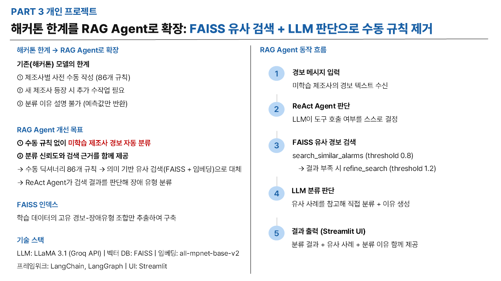
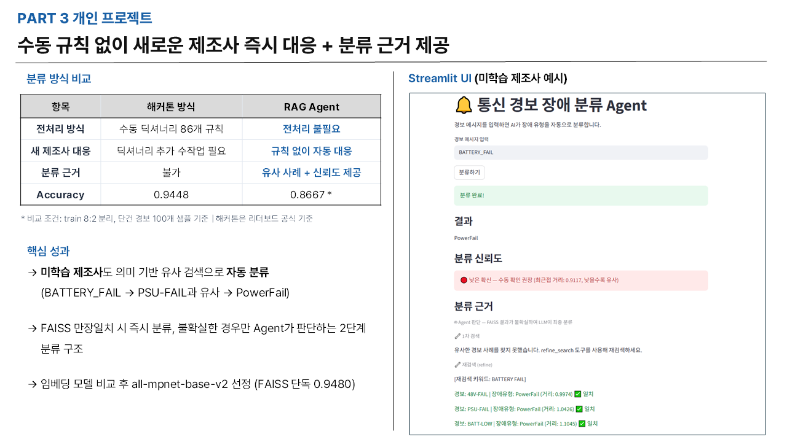

# 🔔 통신 경보 장애 분류 Agent

## 소개

ETRI·KT 통신망 안정화 AI 해커톤(전체 158팀 참가)에서 수행한 경보 분류 과제를 LLM + RAG로 개선한 프로젝트

해커톤 당시 제조사별 경보 표현 차이 문제를 **수동 딕셔너리 86개 규칙**으로 해결했으나 새 제조사가 추가될 때마다 규칙을 수작업으로 추가해야 하는 한계가 있었음. 이를 **규칙 없이 LLM + RAG로 자동 분류**하는 방식으로 개선.





---

## 해커톤 방식과의 비교

### 핵심 문제

- Train: 제조사 A만 존재
- Test: 제조사 A, B, C 존재 → 미학습 제조사 93%
- 제조사마다 동일 장애를 다르게 표현

| 제조사 A | 제조사 B | 제조사 C |
|---------|---------|---------|
| ETH-ERR | ETHER_LINK_DOWN | Loss Of Signal |
| PSU-FAIL | BATTERY_FAIL | Input Power Degrade Defect |
| OPT-LOS | LOSS_OF_SIGNAL | Loss Of Signal |

### 방식 비교

| 항목 | 해커톤 방식 | 이 프로젝트 |
|------|------------|------------|
| 전처리 | 수동 딕셔너리 86개 규칙 작성 | 전처리 불필요 |
| 모델 | fastText + LightGBM + Transformer 앙상블 | LLM + RAG Agent |
| 새 제조사 대응 | 규칙 추가 수작업 필요 | 재학습 없이 자동 대응 |
| 분류 근거 설명 | 불가 | LLM이 자동 생성 |
| 정확도 | 0.9448 (분야2 리더보드 3위 / 59팀) | - |

---

## 시스템 구조

```
새 경보 입력
→ search_similar_alarms: FAISS에서 유사 경보 검색 (threshold 0.8)
→ 결과 없으면 refine_search: 키워드 기반 재검색 (threshold 1.2)
→ LLM이 유사 사례 참고해 장애 유형 분류 + 이유 설명
→ Streamlit UI로 결과 출력
```

ReAct 구조(LangGraph)로 LLM이 검색 결과를 보고 도구 호출 여부를 스스로 판단.

---

## Threshold 설정 근거

`explore_data.py`에서 유사도 분포를 실험해 설정.

| 경보 유형 | 거리 범위 | 해석 |
|---------|---------|------|
| Train에 존재하는 경보 (ETH-ERR 등) | 0.55~0.65 | 정확한 매칭 |
| 유사하지만 장애유형 혼재 시작 | 0.90 이상 | 신뢰도 낮음 |
| Train에 없는 B사 표현 (BATTERY_FAIL 등) | 1.22 이상 | 미학습 제조사 |

- **1차 threshold 0.8**: 신뢰할 수 있는 매칭만 필터링
- **2차 threshold 1.2**: 미학습 제조사 경보도 유사 사례 포함

---

## 성능 비교

`evaluate_faiss.py`에서 수행. FAISS와 RAG 평가는 단건 경보 입력 기준이며 해커톤 원본은 ticketno 단위 시퀀스 입력 기준으로 조건이 다름.

| 방식 | Accuracy | 평가 조건 |
|------|----------|---------|
| FAISS 단독 | 0.9480 | 단건 경보 500개 |
| RAG (LLM) | 0.8667 | 단건 경보 30개, Groq 무료 API |
| Agent | 0.8667 | 단건 경보 30개 |
| 해커톤 원본 | 0.9448 | ticketno 시퀀스 기반, 공식 리더보드 |

FAISS 단독과 해커톤 원본의 차이는 입력 단위가 다르기 때문. FAISS는 단건 경보 입력, 해커톤 원본은 ticketno 단위 시퀀스 입력.

---

## 기술 스택

- **LLM**: LLaMA 3.1 8B (Groq API)
- **벡터DB**: FAISS (로컬)
- **임베딩**: sentence-transformers/all-mpnet-base-v2 (MTEB 57.8 → 벤치마크로 선정)
- **프레임워크**: LangChain, LangGraph (ReAct Agent)
- **UI**: Streamlit

---

## 분류 대상

- **LinkCut**: 네트워크 링크 장애
- **PowerFail**: 전원 공급 장애
- **UnitFail**: 장치 유닛 장애

---

## 프로젝트 구조

```
alarm-rag-agent/
├── agent.py          # 벡터DB 로드, ReAct Agent 구성 (도구 2개)
├── app.py            # Streamlit UI
├── evaluate_faiss.py # FAISS 단독 / RAG / Agent 성능 비교 평가
└── explore_data.py   # 유사도 분포 분석 및 threshold 설정 근거
```

## 실행 방법

```bash
pip install -r requirements.txt
streamlit run app.py
```

## 데이터

- 출처: ETRI·KT 통신망 안정화 AI 해커톤
- Train: 9,322개 경보 (제조사 A)
- Test: 37,671개 경보 (제조사 A/B/C)
- 데이터는 보안상 제외 (.gitignore 처리)