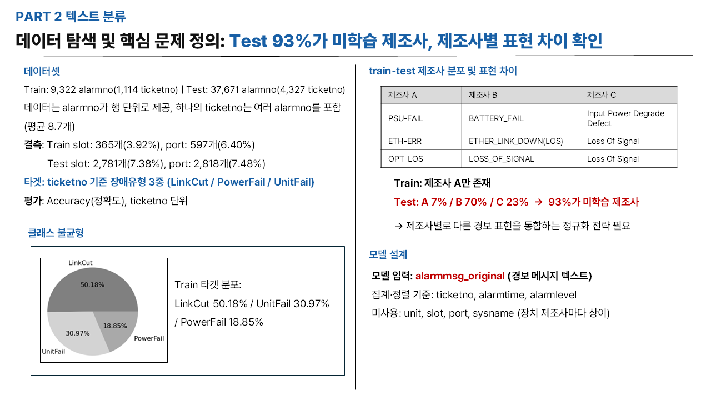
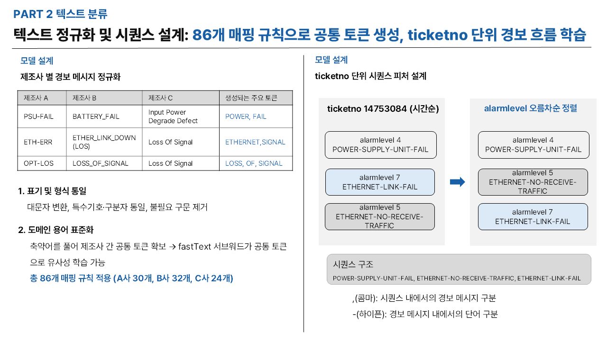
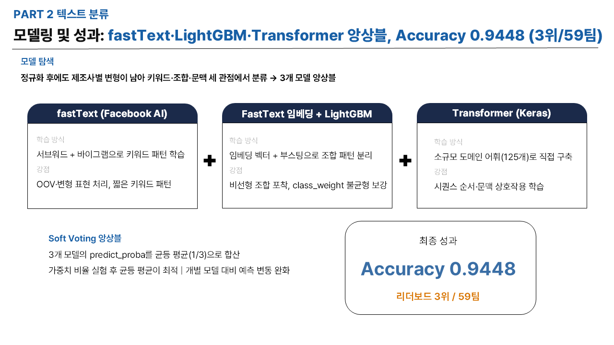

# 장애 경보 분류 (Fault Alarm Classification)

통신 장비 경보 메시지를 기반으로 장애 유형을 자동 분류하는 NLP 모델

**Accuracy 0.9448** — 59팀 중 3위

---

## 프로젝트 개요

| 항목 | 내용 |
|------|------|
| 기간 | 2023.07 ~ 09 (3개월) |
| 인원 | 4인 팀 |
| 역할 | EDA 수행, 문제 정의 및 텍스트 정규화 방향 논의 |
| 대회 | ETRI·KT 통신망 안정화 AI 해커톤 |
| 문제 유형 | 텍스트 분류 (NLP) |
| 평가 지표 | Accuracy (ticketno 단위) |

---

## 문제 정의

전표(ticketno)별 경보 메시지를 **LinkCut / PowerFail / UnitFail** 3가지 장애 유형으로 분류하는 문제.

핵심 난이도는 **Train에는 제조사 A만 존재하지만, Test에는 A/B/C 3개 제조사가 존재하여 93%가 미학습 제조사**라는 점. 같은 장애를 제조사마다 다르게 표현하기 때문에 이를 통합하는 정규화 전략이 필수였음.

### 제조사별 경보 표현 차이

| 제조사 A | 제조사 B | 제조사 C | 장애 유형 |
|---------|---------|---------|---------|
| PSU-FAIL | BATTERY_FAIL | Input Power Degrade Defect | PowerFail |
| ETH-ERR | ETHER_LINK_DOWN(LOS) | Loss Of Signal | LinkCut |
| OPT-LOS | LOSS_OF_SIGNAL | Loss Of Signal | LinkCut |

---

## 데이터셋

| 구분 | 크기 | 비고 |
|------|------|------|
| Train | 9,322 alarmno (1,114 ticketno) | 제조사 A만 존재 |
| Test | 37,671 alarmno (4,327 ticketno) | 제조사 A 7% / B 70% / C 23% |
| 단위 | alarmno (행 단위) | 하나의 ticketno에 여러 alarmno 포함 (평균 8.7개) |
| 타겟 | 장애 유형 3종 | LinkCut, PowerFail, UnitFail |

### 클래스 분포 (Train)

| 장애 유형 | 비율 |
|---------|------|
| LinkCut | 50.18% |
| UnitFail | 30.97% |
| PowerFail | 18.85% |

### 결측치 현황

| 구분 | slot | port |
|------|------|------|
| Train | 365개 (3.92%) | 597개 (6.40%) |
| Test | 2,781개 (7.38%) | 2,818개 (7.48%) |

### 주요 피처

| 피처 | 설명 | 사용 여부 |
|------|------|---------|
| alarmmsg_original | 경보 메시지 텍스트 | **모델 입력** |
| ticketno | 전표 번호 (경보 그룹 단위) | 집계 기준 |
| alarmtime | 경보 발생 시각 | 정렬 기준 |
| alarmlevel | 경보 심각도 | 정렬 기준 |
| unit, slot, port | 장치 위치 정보 | 미사용 (제조사마다 상이) |
| sysname | 장치 이름 | 미사용 (제조사마다 상이) |

---

## 실행 순서

| 순서 | 파일 | 내용 |
|------|------|------|
| 1 | EDA.ipynb | 데이터 탐색, 클래스 분포, 제조사별 표현 차이 분석 |
| 2 | fasttext_model.ipynb | FastText 기반 서브워드 학습 및 키워드 패턴 분류 |
| 3 | lightgbm_FastText_model.ipynb | FastText 임베딩 + LightGBM 최종 분류 |
| 4 | transformer_model.ipynb | Transformer 시퀀스 학습 |
| 5 | soft_voting_with_model_3.ipynb | 3개 모델 Soft Voting 앙상블 |
