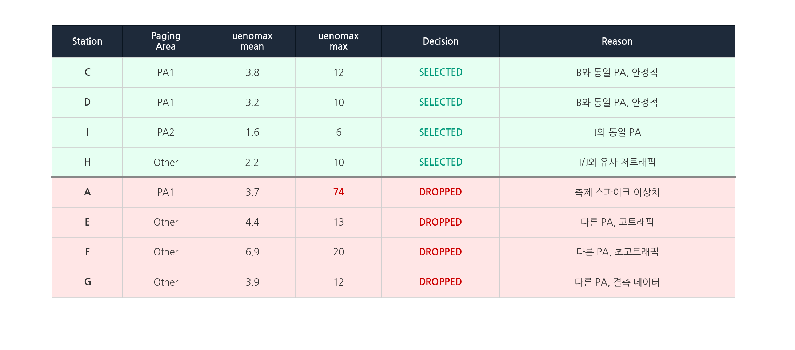
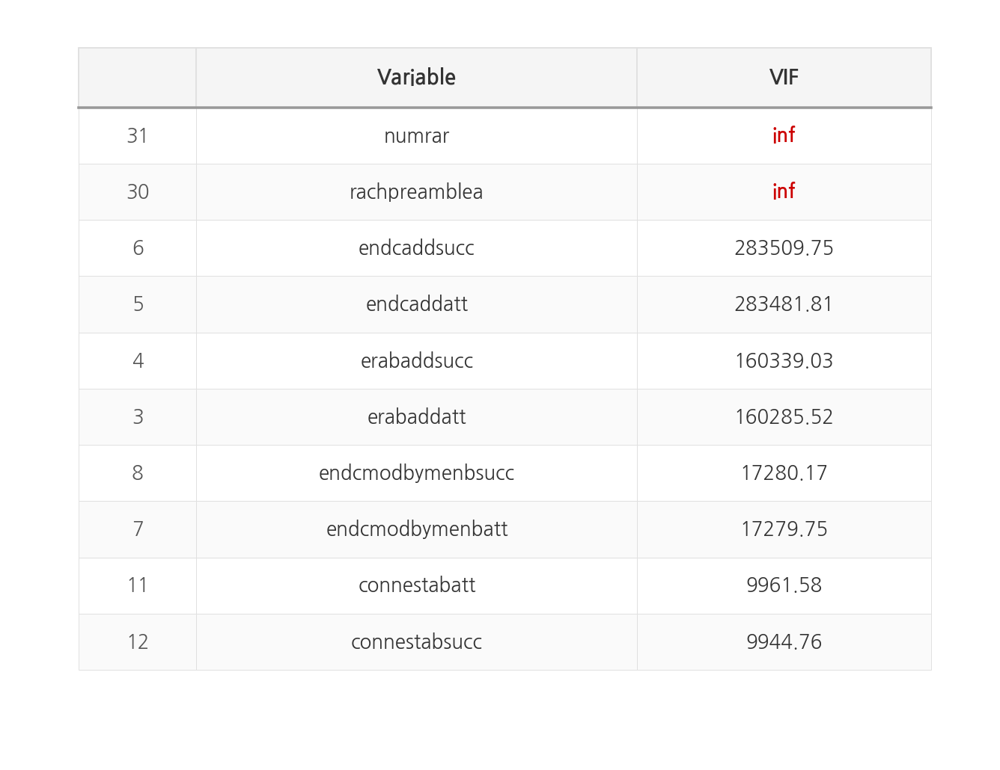

# 무선 트래픽 예측 (Wireless Traffic Prediction)

무선 기지국 RU 통계 데이터를 기반으로 축제 지역 인구 수를 예측하는 시계열 회귀 모델

**MAE 0.3990** — 59팀 중 6위

| 항목 | 내용 |
|------|------|
| 기간 | 2023.07 ~ 09 (3개월) |
| 인원 | 4인 팀 |
| 역할 | 선행실험(ARIMA/SARIMA) → 트리 기반 모델 전환, PA 기반 기지국 선별, 피처 엔지니어링, 모델링 |
| 대회 | ETRI·KT 통신망 안정화 AI 해커톤 |
| 평가 지표 | MAE (Mean Absolute Error) |

---

### 목차

- [1. 문제 정의](#1-문제-정의)
- [2. EDA 및 기지국 선별](#2-eda-및-기지국-선별)
- [3. 피처 엔지니어링](#3-피처-엔지니어링)
- [4. 모델링 및 성과](#4-모델링-및-성과)
- [5. 결론](#5-결론)
- [6. 배운점](#6-배운점)

---

# 1. 문제 정의

- 축제·행사 지역에 인구가 밀집되면 통신 품질 저하와 안전사고 위험이 높아진다. 이를 사전에 예측해서 통신 자원을 선제 배치하는 것이 목표다.
- 축제 지역 10곳 기지국(RU)의 통신 통계 데이터로 **기지국 범위 내 인구 수(uenomax)를 예측**한다.
- 데이터는 업/다운링크 트래픽, BLER, RSSI, 단말 수 등 5분 단위 RU 통계로 구성되어 있다.
- 핵심 난이도: **학습 기지국(8개)과 테스트 기지국(2개)이 물리적으로 다른 위치**에 있다. → Paging Area 기반으로 유사 커버리지 기지국을 선별해서 해결했다.

---

# 2. EDA 및 기지국 선별

| 구분 | 크기 | 비고 |
|------|------|------|
| Train | 137,445행 x 39열 | 기지국 A, C, D, E, F, G, H, I (8개) |
| Test | 34,362행 x 38열 | 기지국 B, J (2개) — 미학습 |
| 수집 주기 | 5분 단위 | 60일간 수집 |
| 결측치 | Train 16개 변수 9건 (0.006%) | Test 결측 없음 |
| 타겟 | uenomax | 기지국 범위 내 단말 수 최댓값 (단말 1대 = 사용자 1명) |

- 축제 기간 기지국 A에서 uenomax 스파이크가 발견됐다. (최대 74)
  - 다른 기지국 max = 6~20인데 A만 비정상적으로 높다.
  - Test 기지국에서는 해당 패턴이 없어서 학습 데이터에 포함하면 분포 왜곡이 발생한다.

- **attpaging**(페이징 시도 횟수): 코어 네트워크가 동일한 호출 신호를 보내는 기지국 그룹을 의미한다. 같은 Paging Area(PA)에 속한 기지국들은 attpaging 값이 유사하게 나타나므로, 이 값을 비교하면 **같은 커버리지 구역에 있는 기지국을 식별**할 수 있다.
- attpaging 값 비교로 Test 기지국과 유사 커버리지 기지국을 매칭했다.
  - Test(B) → A, C, D와 같은 커버리지 구역(PA1)으로 판단
  - Test(J) → I와 같은 커버리지 구역(PA2)으로 판단

- 스파이크 발생 기지국 A 제거 → 데이터 분산 **48% 감소** (std 3.05 → 1.58)
- 최종 선택: C, D, I, H / 제외: A, E, F, G

---

# 3. 피처 엔지니어링

### 3-1. Lag 변수 생성

- 직전 시점 자기상관이 0.70~0.96으로 높다. → 주요 6개 변수에 Lag-1을 생성했다.
- Lag 생성 시 첫 행 결측 → 동일 시간대·기지국 평균으로 보간했다.
- Lag-2, Lag-12 대비 Lag-1 단독이 가장 낮은 MAE를 기록했다.

### 3-2. 시간대 변수 생성

- 시간대별 uenomax 평균 차이가 뚜렷하다. (2.38~4.75) → 시간대 변수를 추가했다.

### 3-3. 다중공선성 완화

- 성공과 시도 피처 간 상관계수가 0.99 이상이다. → 시도 피처만 선택했다. (succ 제거)
- VIF가 큰 피처를 제거해서 다중공선성을 완화했다.
- 최종: 36개 원본에서 8개 제거 + 8개 파생변수 추가 → **36개 피처**로 학습했다.

---

# 4. 모델링 및 성과

- **모델 탐색**:
  - ARIMA/SARIMA → 단변량 구조로 38개 피처 활용이 불가하고, 60일 데이터로 장기 패턴 학습에 한계가 있다.
  - LSTM → 기지국당 ~17,000행으로 학습 데이터가 부족하고, 튜닝 대비 성능 개선이 미미하다.
  - 트리 기반 → Lag 변수로 시간 의존성 학습이 가능하다.
- **튜닝**: Optuna로 각 모델을 개별 튜닝했다. → 탐색 범위 설정 후 교차검증 기반으로 최적 파라미터를 선정했다.
- **앙상블**: XGB + LGBM 예측을 균등 평균했다. → 가중치 비율 실험 후 균등 평균이 최적이었다.
  - 80% 데이터로 검증 → 100% 재학습 후 최종 제출했다.

| model | Validation MAE | Test MAE |
|-------|---------------|----------|
| XGB+LGBM 튜닝 | 0.4718 | **0.4852** |
| XGB+LGBM | 0.4719 | 0.4881 |
| CatBoost | 0.4764 | 0.4957 |
| LightGBM | 0.4767 | 0.4940 |
| XGBoost | 0.4919 | 0.5148 |
| Random Forest | 0.4929 | 0.5034 |

> **참고**: 위 Test MAE는 자체 테스트셋 기준이고, 최종 리더보드 점수(MAE 0.3990)는 대회 측 평가 데이터셋 기준이다.

---

# 5. 결론

- **최종 성과**: MAE 0.3990 (리더보드 6위 / 59팀)
- Paging Area 기반 기지국 선별이 가장 큰 성능 기여 요인이었다. 도메인 지식을 활용한 데이터 선별이 모델 복잡도를 높이는 것보다 효과적이었다.
- 트리 기반 앙상블 + Lag 피처 조합으로 시계열 특성과 다변량 피처를 동시에 활용할 수 있었다.

---

# 6. 배운점

- **도메인 지식의 중요성**: 통신 도메인 지식 없이는 attpaging으로 Paging Area를 식별하는 접근이 불가능했다. 데이터를 잘 고르는 것이 모델을 잘 만드는 것보다 선행되어야 한다는 걸 체감했다.
- **이상치 처리의 임팩트**: 기지국 A 하나를 제거했을 뿐인데 분산이 48% 감소했다. 이상치를 단순히 통계적으로 제거하는 것이 아니라, 왜 이상치인지(축제 스파이크)를 이해하고 제거 근거를 명확히 하는 과정이 중요했다.
- **단순한 앙상블의 효과**: 복잡한 가중치 앙상블보다 XGB + LGBM 균등 평균이 최적이었다. 모델 다양성이 확보되면 단순 평균만으로도 충분한 성능 개선을 얻을 수 있었다.
- **선행실험의 가치**: ARIMA/SARIMA로 시작해서 한계를 직접 확인한 뒤 트리 기반으로 전환했다. 실패한 실험도 모델 선택의 근거가 되었고, 왜 특정 모델을 선택했는지 설명할 수 있게 해줬다.

---

### 실행 순서

| 순서 | 파일 | 내용 |
|------|------|------|
| 1 | 1_EDA.ipynb | 데이터 탐색, 스파이크 발견, 기지국 선별 |
| 2 | 2_학습용.ipynb | 피처 엔지니어링, 모델 학습, Optuna 튜닝 |
| 3 | 3_추론용.ipynb | 최종 모델로 결과 추론 |

---

<b>피처 구성 (38개)</b>

피처는 기지국 간 통신(20개)과 기지국-단말 간 통신(18개)으로 구분된다.

**기지국 ↔ 기지국 통신 (20개)**

| 피처 | 설명 |
|------|------|
| scgfail / scgfailratio | 5G 연결(SCG) 실패 횟수 / 실패율 |
| erabaddatt / erabaddsucc | 데이터 연결(E-RAB) 생성·변경 시도 / 성공 |
| endcaddatt / endcaddsucc | LTE→5G 기지국(SgNB) 추가 시도 / 성공 |
| endcmodbymenbatt / succ | LTE 기지국이 5G 기지국 변경 시도 / 성공 |
| endcmodbysgnbatt / succ | 5G 기지국이 LTE 기지국 변경 시도 / 성공 |
| handoveratt / handoversucc | 기지국 간 핸드오버 시도 / 성공 |
| reestabatt / reestabsucc | 연결 끊긴 단말의 재설정 시도 / 성공 |
| connestabatt / connestabsucc | 단말의 기지국 연결 시도 / 성공 |
| endcrelbymenb | LTE→5G 연결 해제 횟수 |

**기지국 ↔ 단말 통신 (18개)**

| 피처 | 설명 |
|------|------|
| rlculbyte / rlcdlbyte | 업링크 / 다운링크 데이터 크기 |
| airmaculbyte / airmacdlbyte | 물리 채널 기반 업/다운링크 데이터 크기 |
| totprbulavg / totprbdlavg | 업/다운링크 무선 자원(PRB) 사용 평균 |
| bler_ul / bler_dl | 업/다운링크 블록 오류율 |
| dlreceivedriavg | 수신 신호 경로 수(RI) 평균 |
| dltransmittedmcsavg | 데이터 전송 방식(MCS) 평균 |
| dlreceivedcqiavg | 채널 품질(CQI) 평균 |
| rssipathavg | 수신 신호 세기(RSSI) 평균 |
| rachpreamblea | 네트워크 신규 연결 시도(Preamble) 수 |
| numrar / nummsg3 | 접속 응답(RAR) / MSG3 응답 횟수 |
| attpaging | 페이징 시도 횟수 |
| redirectiontolte_coverageout | 5G→LTE 전환 (커버리지 이탈) |
| redirectiontolte_epsfallback | 5G→LTE 전환 (EPS Fallback) |
| redirectiontolte_emergencyfallback | 5G→LTE 전환 (긴급 Fallback) |

<b>약어 정리</b>

| 약어 | 의미 |
|------|------|
| CQI | Channel Quality Indicator |
| E-RAB | E-UTRAN Radio Access Bearer |
| MCS | Modulation and Coding Scheme |
| MeNB | Master E-UTRAN Node B |
| PA | Paging Area |
| PRB | Physical Resource Block |
| RI | Rank Indicator |
| RSSI | Received Signal Strength Indicator |
| RU | Radio Unit |
| SCG | Secondary Cell Group |
| SgNB | Secondary Next Generation Node B |
| UE | User Equipment |

